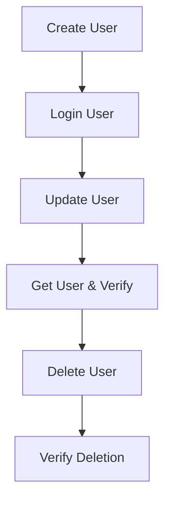

# 🏦 AAIB API Automation Testing Framework

**Arab African International Bank API Testing Suite** - A comprehensive REST API automation framework built with **RestAssured**, **TestNG**, and **Allure Reports** for testing banking and user management APIs.

[](https://openjdk.java.net/)
[](https://rest-assured.io/)
[](https://testng.org/)
[](https://qameta.io/allure/)
[](LICENSE)

---

## 📋 Overview

This project implements a robust API testing framework specifically designed for testing REST API endpoints. The framework focuses on **complete user lifecycle testing** including user registration, authentication, profile management, and account operations using the [ReqRes](https://reqres.in/) demo API.

### 🎯 Key Features

- ✅ **Complete User Journey Testing** - End-to-end user lifecycle validation
- ✅ **Request/Response Specifications** - Reusable and maintainable test components
- ✅ **Dynamic Test Data Generation** - Faker-powered realistic test data
- ✅ **Comprehensive Reporting** - Allure reports with detailed test execution insights
- ✅ **POJO-Based Request/Response Handling** - Type-safe API interactions
- ✅ **Parallel Test Execution Support** - Scalable test execution
- ✅ **JSON Schema Validation** - Robust response validation

---

## 🚀 Tech Stack

| Component | Technology | Version | Purpose |
|-----------|------------|---------|---------|
| **Language** | Java | 17+ | Core programming language |
| **Test Framework** | TestNG | 7.11.0 | Test organization and execution |
| **HTTP Client** | RestAssured | 5.5.5 | API testing and validation |
| **Build Tool** | Maven | 3.9+ | Dependency management |
| **JSON Processing** | Jackson | 2.20.0 | JSON serialization/deserialization |
| **Test Data** | JavaFaker | 1.0.2 | Dynamic test data generation |
| **Reporting** | Allure | 2.30.0 | Test reporting and visualization |
| **IDE** | IntelliJ IDEA | Community | Development environment |

---

## 🏗️ Project Structure

```
aaib-api-testing/
│
├── 📄 pom.xml                    # Maven dependencies and plugins
├── 📄 testng.xml                 # TestNG suite configuration
├── 📄 README.md                  # Project documentation
├── 📄 .gitignore                 # Git ignore patterns
│
├── src/
│   ├── main/java/
│   │   └── Pojo/
│   │       └── User.java         # User POJO for request/response objects
│   │
│   └── test/java/
│       ├── TestData/
│       │   └── Data.java         # Test configuration and data providers
│       └── Utils/
│              └── UserJourney.java # Complete user lifecycle test suite
│
└── target/
    ├── allure-results/           # Raw Allure test results
    └── allure-report/            # Generated HTML reports
```

---

## ⚙️ Prerequisites & Setup

### 🔧 System Requirements

- **Java Development Kit (JDK)**: 17 or higher
- **Apache Maven**: 3.9 or higher
- **Allure CLI**: For report generation (optional)

### 📦 Installation Steps

1. **Clone the repository**
   ```bash
   git clone <repository-url>
   cd aaib-api-testing
   ```

2. **Verify Java installation**
   ```bash
   java -version
   # Should display: java version "17.x.x" or higher
   ```

3. **Verify Maven installation**
   ```bash
   mvn -version
   # Should display Maven version 3.9+
   ```

4. **Install project dependencies**
   ```bash
   mvn clean install
   ```

---

## 🧪 Test Execution

### ▶️ Run Complete Test Suite

```bash
mvn clean test -DsuiteXmlFile=testng.xml
```

### ▶️ Run Specific Test Class

```bash
mvn test -Dtest=Utils.UserJourney
```

### ▶️ Run Tests with Custom Configuration

```bash
mvn test -Dparallel=classes -DthreadCount=3
```

---

## 📊 Reporting & Results

### 🔍 Generate Allure Report

**Option 1: Serve Report (Interactive)**
```bash
allure serve target/allure-results
```
*Generates and opens interactive report in browser*

**Option 2: Generate Static Report**
```bash
allure generate target/allure-results --clean -o target/allure-report
```
*Generates static HTML report in `target/allure-report/`*

### 📈 Report Features

- **Test Execution Timeline** - Visual test execution flow
- **Step-by-Step Logging** - Detailed request/response information
- **Screenshots & Attachments** - Visual validation evidence
- **Retry Analysis** - Failed test retry insights
- **Historical Trends** - Test execution trends over time

---

## 🧠 Test Scenarios

### UserJourney Test Suite

The `UserJourney` class implements a comprehensive user lifecycle testing approach:

| Test Method | HTTP Method | Endpoint | Description |
|-------------|-------------|----------|-------------|
| `createUser()` | POST | `/users/register` | Creates new user account |
| `loginUser()` | POST | `/users/login` | Authenticates user credentials |
| `updateUser()` | PATCH | `/users/{id}` | Updates user profile information |
| `getUserAndVerify()` | GET | `/users/{id}` | Retrieves and validates user data |
| `deleteUser()` | DELETE | `/users/{id}` | Removes user account |
| `verifyUserIsDeleted()` | GET | `/users/{id}` | Confirms account deletion |

### 🔄 Test Flow Architecture



---

## 🛠️ Configuration

### TestNG Configuration (`testng.xml`)

```xml
<?xml version="1.0" encoding="UTF-8"?>
<suite name="API Test Suite" verbose="1" parallel="false">
    <test name="User Journey API Tests">
        <classes>
            <class name="Utils.UserJourney"/>
        </classes>
    </test>
</suite>
```

### Test Data Configuration (`Data.java`)

- **Base URI**: `https://reqres.in/api/`
- **API Key**: Configurable authentication key
- **Dynamic Data**: Faker-generated test data for each test run

---

## 🧰 Useful Commands

| Command | Description |
|---------|-------------|
| `mvn clean test` | Execute all tests |
| `mvn test -DsuiteXmlFile=testng.xml` | Run specific test suite |
| `mvn test -Dtest=UserJourney` | Execute specific test class |
| `allure serve target/allure-results` | Generate and view Allure report |
| `mvn allure:report` | Generate Allure report via Maven |
| `mvn dependency:tree` | View project dependency tree |
| `mvn clean compile` | Compile project without running tests |

---

## 🎯 Best Practices Implemented

- **Page Object Model** - Request/Response specification reuse
- **Data-Driven Testing** - Dynamic test data generation
- **Assertion Libraries** - Comprehensive validation
- **Logging Integration** - Detailed test execution logs
- **Parallel Execution** - Scalable test execution
- **CI/CD Ready** - Maven-based build automation

---

## 🧑‍💻 Author & Contact

**Mohamed Tarek** - *Software Test Automation Engineer*

📧 **Email**: [m.tareek98@gmail.com](mailto:m.tareek98@gmail.com)
💼 **LinkedIn**: [Mohamed Tarek](https://linkedin.com/in/mohamed-tarek)
🏷️ **Specialization**: API & UI Test Automation | CI/CD Enthusiast

---

## 📝 License

This project is licensed under the **MIT License** - see the [LICENSE](LICENSE) file for details.

---

## 🤝 Contributing

1. Fork the repository
2. Create a feature branch (`git checkout -b feature/amazing-feature`)
3. Commit your changes (`git commit -m 'Add amazing feature'`)
4. Push to the branch (`git push origin feature/amazing-feature`)
5. Open a Pull Request

---

## 📋 Changelog

### Version 1.0.0
- ✅ Initial framework setup with RestAssured and TestNG
- ✅ Complete user journey test implementation
- ✅ Allure reporting integration
- ✅ Dynamic test data generation with JavaFaker
- ✅ Maven build automation and dependency management

---

**🎉 Ready to automate your API testing journey with AAIB Test Framework!**
